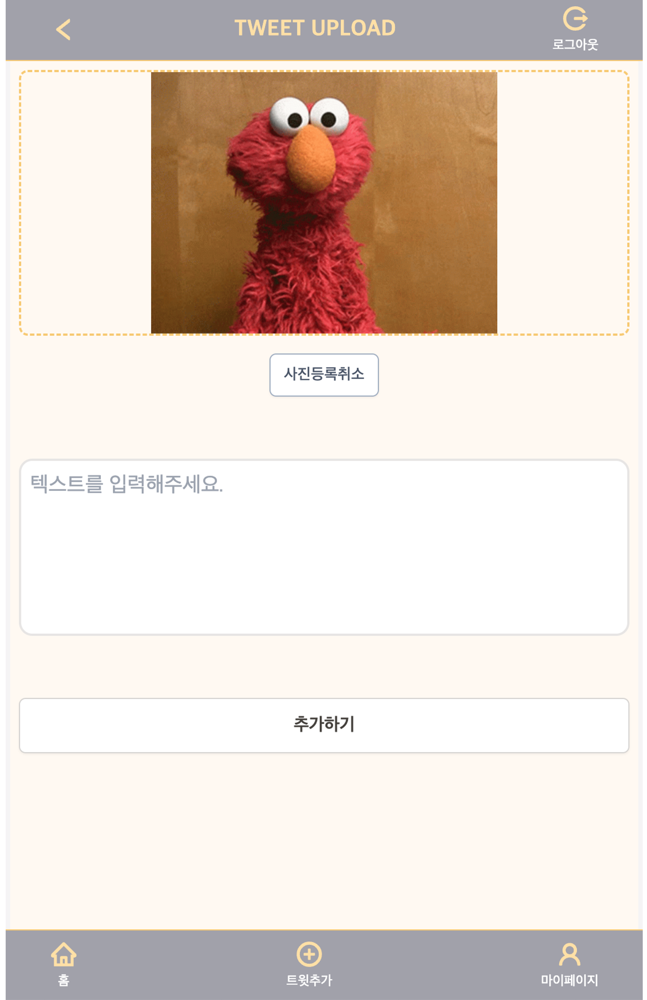

<p>


</p>

## 🐹 프로젝트 개요

트위터 클론 코딩 기반 커뮤니티 프로젝트

## 🚀 프로젝트 확인 해보기

[배포 페이지로 이동하기](https://dam-witter.vercel.app)<br/>

## 🗓️ 프로젝트 제작

### 제작 : 2023.7.17 ~ 7.25

### 구현

#### 1. 낙관적 업데이트

- 좋아요 및 코멘트 삭제 기능을 낙관적 업데이트를 사용하여 **사용자에게 즉각적인 반응**을 줍니다.
- 낙관적 업데이트를 적용된 부분에서 에러 날경우 롤백이 적용됩니다.
- **서버리스함수인 API route의 콜드스타트로 발생되는 지연 시간으로 떨어지는 사용자 경험을 보완**하고자, 좋아요 및 댓글삭제 기능에 낙관적 업데이트를 적용했습니다.

#### 2. 인증 처리 방법

- 쿠키를 확인하여 인증상태를 구별하고 그에 따라 라우팅을 조정합니다.
- Next.js의 **middleware를 사용하여 라우팅 요청마다 서버 사이드에서 쿠키의 유무를 확인하고 라우팅을 조정**합니다.

#### 3. 제어 컴포넌트 폼관리 커스텀 훅 생성

- 폼 처리를 위해 `useForm`이라는 커스텀 훅과 유효성 검사기를 결합해 사용했습니다.
- 처음에는 React의 배치 업데이트 기능을 충분히 고려하지 못해, 사용자의 입력 값과 검증된 값 간에 동기화 이슈가 발생했습니다. <br/>해당 이슈는 사용자의 입력 값을 직접 검증하는 대신, 입력 상태를 얕은 복사본을 만들어 검증함으로써 해결했습니다.

## 👀 프로젝트 프리뷰 및 상세 내용

#### 메인화면

- 로그인 유저인 경우일 때만 접근이 가능합니다
- 비로그인 유저일 경우 로그인 페이지로 리다이렉트 합니다.

<p align='center'>

</p>

#### 로그인

- 로그인이 실패할 경우 (이메일 또는 비밀번호가 올바르지 않은 경우 또는 존재하지 않을 이메일 경우) **에러 토스트메시지**를 띄워줍니다.
- 로그인 **입력에 대한 유효 검증 메시지를 텍스트 메시지**로 알려줍니다.

| 기본                                                        | 로그인 중 잘못된 입력시, 텍스트 메시지로 알람                             | 로그인 중 에러가 발생시, 토스트 에러메시지                                |
| ----------------------------------------------------------- | ------------------------------------------------------------------------- | ------------------------------------------------------------------------- |
|  |  |  |

#### 회원가입

- 회원가입에 실패할 경우 (동일한 이메일이 있을 경우) **에러 토스트메시지**를 띄워줍니다.
- 회원가입 **입력에 대한 유효 검증 메시지를 텍스트 메시지**로 알려줍니다.
  - 이메일, 비밀번호, 비밀번호 확인(비밀번호와 동일한 비밀번호 인지 검증합니다.)

| 기본                                                                   | 회원가입중 잘못된 입려시, 텍스트 메시지로 알람                               | 회원가입중 중 에러가 발생시, 토스트 에러메시지                               |
| ---------------------------------------------------------------------- | ---------------------------------------------------------------------------- | ---------------------------------------------------------------------------- |
|  |  |  |

#### 트윗

1. 트윗 및 코멘트 작성

- 등록시에 콜드 스타트로 인한 지연시간 동안 **사용자의 이상행동을 방지하기위해 코멘트 업로드 폼을 비활성화 시킵니다.**
- 사용자 경험을 위해서 작성자가 트윗을 등록할 때, **이미지 등록 과정을 비동기적으로 처리하여 트윗 등록 시간을 감소**시켰습니다.
  - 사용자가 이미지를 등록하면 바로 cloudflare에 이미지를 등록 과정이 진행됩니다.

2. 낙관적 업데이트

- 트윗 리스트(메인페이지)와 상세페이지에서 좋아요 버튼을 사용할 수 있습니다.<br/> **모든 좋아요 버튼은 낙관적업데이트가 적용**되어있습니다.
- 좋아요 및 코멘트를 조작하면 두 항목의 **갯수**에도 낙관적 업데이트가 동일하게 적용되어있습니다.
  - 코멘트 삭제시, **삭제하는 코멘트를 제거하고 코멘트 갯수를 감소시키는 낙관적 업데이트**가 적용되어있습니다.

3. 내용

- 트윗과 코멘트 작성시간은 '분, 시간, 일, 주' 단위로 기재 됩니다.
- 트윗과 코멘트는 **작성자만 삭제** 할 수 있습니다. (작성자에게만 삭제 버튼을 렌더함)

| 트윗 리스트                                   | 트윗 상세페이지                                      | 트윗 작성                                            |
| --------------------------------------------- | ---------------------------------------------------- | ---------------------------------------------------- |
|  |  |  |

#### 마이페이지

- 최초 가입시에 프로필 사진은 제공하지 않습니다.
  - 사용자가 등록하지 않을 경우, **기본 프로필 이미지를 렌더**합니다.
- **최초 가입시에 자기소개의 기본 값이 적용** 됩니다.
  - (기본 자기소개 값 : `안녕하세요. ${name}입니다.`,)

| 마이페이지                                                                                                         | 내정보수정                                                                                                         | 수정완료 시, 토스트 메시지로 알람                            |
| ------------------------------------------------------------------------------------------------------------------ | ------------------------------------------------------------------------------------------------------------------ | ------------------------------------------------------------ |
|  |  |  |

## 📌 프로젝트 실행 방법

1. Clone the repo

```javascript
$ git clone https://github.com/j2h30728/dam-witter.git
```

2. Install NPM packages

```javascript
$ npm install
```

4. 환경 변수 설정

```javascript
//.env 생성 후, 아래의 설정값 추가
COOKIE_PASSWORD=/*최소 32 이상 랜덤 글자 설정*/
CLOUDFLARE_API_TOKEN=/* cloudflare API token 설정 */
CLOUDFLARE_ACCOUNT_ID=/* cloudflare Account Id 설정 */
DATABASE_URL=/* 데이터베이스 url 설정 */

```

1. Getting Started

```javascript
$ npm run dev
```

<br/>
