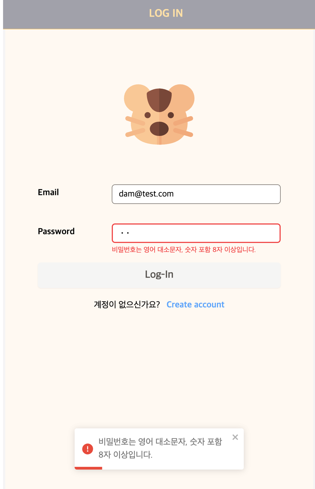
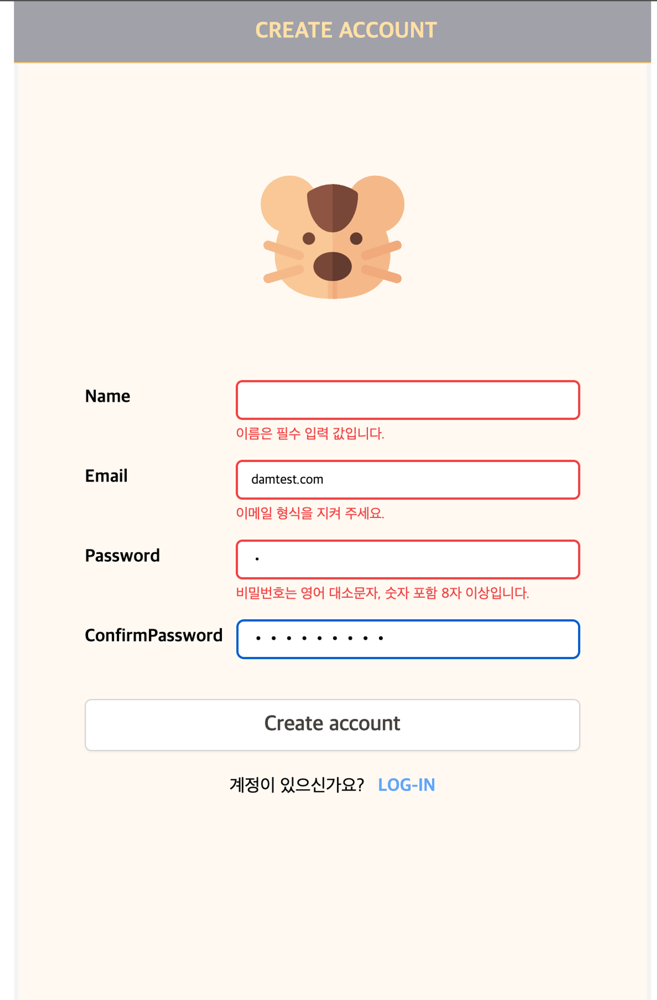
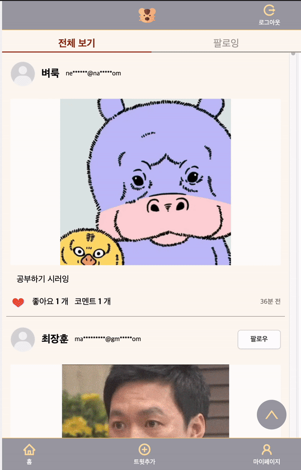
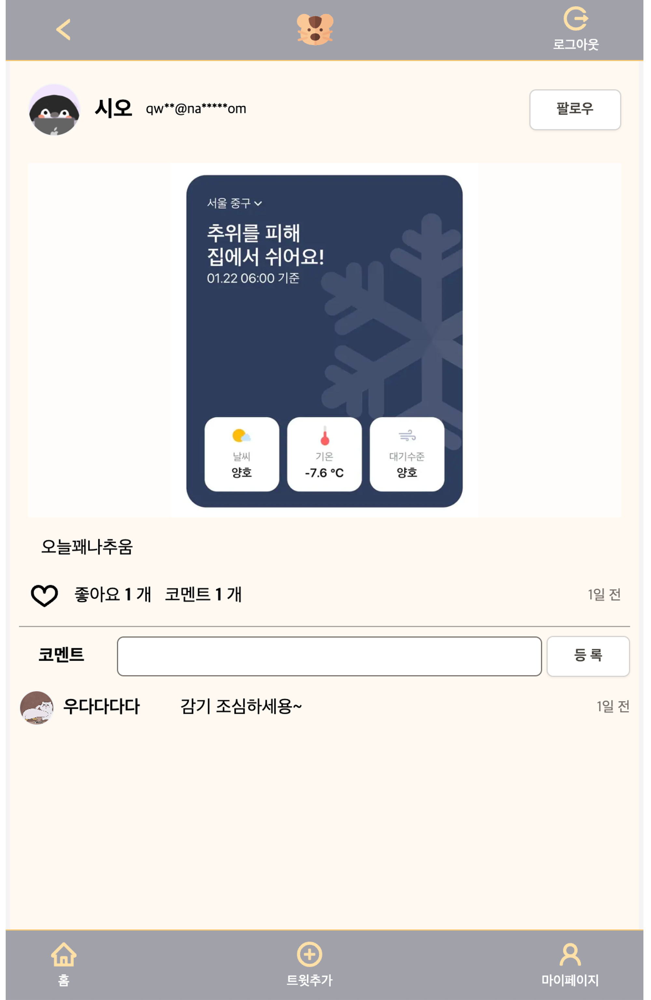

<p>


</p>

## 프로젝트 개요

친구들과 함께 소소하게 일상을 나누는 커뮤니티 풀스택 개인 프로젝트

## 프로젝트 확인 해보기

[배포 페이지로 이동하기](https://dam-witter.vercel.app/)

> 테스트 계정
>
> - Email : test@test.dam
> - Password : qweQWE123

## 프로젝트 대한 간략 내용

모든 항목은 프론트엔드에서의 컴포넌트 및 페이지 등의 구현에서 백엔드에서의 데이터 스키마, API 등의 구현을 진행했습니다.

### 제작 : 2023.7.17 ~ 7.25

- 인증 로직 구현 (회원 가입, 로그인)
- 트윗에 대한 Creat / Read / Delete 구현
- 코멘트에 대한 Create / Read / Delete 구현
- 회원 정보에 대한 Read / Update 구현
- 좋아요 기능 구현 및 낙관적 업데이트 적용

> **계속적으로 리팩토링 및 고도화 진행 중, [Pull Request](https://github.com/j2h30728/dam-witter/pulls?q=is%3Apr) 확인 가능**
>
> <details>
>   <summary>상세 이력 (자세하게 보기)</summary>
>   
>   1. [Feature #2 트윗추가 및 프로필 사진 변경시 이미지 등록 로직 변경 #3](https://github.com/j2h30728/dam-witter/pull/3) : 2023.08.11, Image 등록 로직 리팩토링
>   2. [Feature #9 API mutate 로직 리팩토링 #10](https://github.com/j2h30728/dam-witter/pull/10) : 2023.08.22 ~ 2023.11.12, 자체 커스텀훅 useMutation에서 swr이 제공하는 수동트리거 useSRWMutation으로 리팩토링
>   3. [Feature #13 toast message 추가 및 적용 #14](https://github.com/j2h30728/dam-witter/pull/14) : 2023.11.13 ~ 2023.11.14
>   4. 로그인 인증에 관련된 로직 변경 :
>      - [Feature: 로그아웃시 로그인된 회원정보 초기화 #16](https://github.com/j2h30728/dam-witter/pull/16) : 2023.11.20
>      - [Feature #17 middleware 설정 변경 #18](https://github.com/j2h30728/dam-witter/pull/18) : 2023.11.22
>      - [feat: 쿠키옵션 설정 변경 #20](https://github.com/j2h30728/dam-witter/pull/20) : 2023.11.28
>   5. 좋아요API 중복 요청 문제 해결 :
>      - [Feature #21 '좋아요' 버튼 중 복 요청 문제 해결 #22](https://github.com/j2h30728/dam-witter/pull/22) : 2023.12.06 ~2023.12.07, 좋아요 버튼에 debounce 기능추가, 복합키를 유니크키로 두어 중복데이터 등록을 방지
>      - [[REFACTOR] 좋아요 API에서 사용한 트랜잭션을 제거함 #29](https://github.com/j2h30728/dam-witter/pull/29) : 2023.12.15, 중복데이터 등록을 방지는 이미 적용 되어있으며, 데이터베이스의 성능 부하를 줄 뿐만 아니라 오남용으로 판단하여 트랜젝션을 제거함
>   6. 삭제 권한 대한 문지 해결 :
>      - [Feature #24 삭제 권한 취약점 문제 해결 #25](https://github.com/j2h30728/dam-witter/pull/25) : 2023.12.11
>      - [Feature #26 트윗 및 코멘트 삭제 기능 관련 문제 해결 #27](https://github.com/j2h30728/dam-witter/pull/27) : 2023.12.12
>   7. 무한 스크롤 기능 구현 :
>      - [Feature #32 트윗 리스트를 무한 스크롤 구현 #33](https://github.com/j2h30728/dam-witter/pull/33) : 2023.12.23~2023.12.24
>      - [Feature #34 트윗 리스트를 무한 스크롤 구현 2 (보완)#35](https://github.com/j2h30728/dam-witter/pull/35) : 2023.12.25
>   8. 팔로잉 기능 구현 :
>      - [Feature #47 팔로잉 기능 추가](https://github.com/j2h30728/dam-witter/pull/48) : 2024.01.22~2024.01.23
>      - [Feature #49 팔로우, 팔로잉 리스트를 렌더 기능 및 페이지 구현](https://github.com/j2h30728/dam-witter/pull/50) : 2024.01.23
> </details>

### 추가 기능구현 :

- **[무한스크롤 구현](https://github.com/j2h30728/dam-witter/pull/33)** : 2023.12.23 ~ 25
- **[팔로잉 기능 구현](https://github.com/j2h30728/dam-witter/pull/48)** : 2024.01.22 ~ 23
  - 추가
    - 프로필 페이지 구현
    - 트윗을 좋아요한 사람에 대한 리스트 구현

## 프로젝트 프리뷰 및 상세 내용

## 인증

로그인 유저인 경우일 때에만 해당 서비스에 접근이 가능합니다.

비로그인 유저일 경우 로그인 페이지로 리다이렉트 합니다.
(비로그인이 접근할 수 있는 페이지 : 로그인페이지, 회원가입 페이지)

- 쿠키를 확인하여 인증상태를 구별하고 그에 따라 라우팅을 조정합니다.
- Next.js의 **middleware를 사용하여 라우팅 요청마다 서버 사이드에서 세션의 로그인 사용자 유무를 확인하고 라우팅을 조정**합니다.

> **middleware 및 쿠키옵션 설정 변경**
>
> 초기 설계에서는 미들웨어가 쿠키의 키값(‘dam-witter’) 존재 여부로 로그인 상태를 판별했습니다.
> 그러나, 이 방식은 외부에서 임의의 쿠키의 키 값을 주입하는 경우에도 로그인 상태로 인식될 위험이 있었습니다. 이를 해결하기 위해 로그인 시 세션에 저장된 ‘user’ 값의 유무로 로그인 상태를 판별하는 방식으로 변경했습니다.
>
> 이 변경사항은 “[Feature #17 middleware 설정 변경](https://github.com/j2h30728/dam-witter/pull/18)” 풀리퀘스트에 반영되었습니다.
>
> 또한, 추가적인 보안 강화를 위해 쿠키 옵션을 변하였으며 “[feat: 쿠키옵션 설정 변경](https://github.com/j2h30728/dam-witter/pull/20)” 풀리퀘스트에 반영되었습니다.

### 로그인

- 로그인이 실패할 경우 (이메일 또는 비밀번호가 올바르지 않은 경우 또는 존재하지 않을 이메일 경우) **에러 토스트메시지**를 띄워줍니다.
- 로그인 **입력에 대한 유효 검증 메시지를 텍스트 메시지**로 알려줍니다.

### 회원가입

- 회원가입에 실패할 경우 (동일한 이메일이 있을 경우) **에러 토스트메시지**를 띄워줍니다.
- 회원가입 **입력에 대한 유효 검증 메시지를 텍스트 메시지**로 알려줍니다.
  - 이메일, 비밀번호, 비밀번호 확인(비밀번호와 동일한 비밀번호 인지 검증합니다.)

| 로그인 중 잘못된 입력시, 텍스트 및 토스트 메시지로 알람 | 회원가입 중 에러가 발생시, 텍스트 및 토스트 메시지로 알람 | 회원가입 중 서버 에러 응답을 토스트 메시지로 알람        |
| ------------------------------------------------------- | --------------------------------------------------------- | -------------------------------------------------------- |
|             |   |  |

- 좋아요 및 코멘트를 조작하면 두 항목의 **갯수**에도 낙관적 업데이트가 동일하게 적용되어있습니다.
  - 코멘트 삭제시, **삭제하는 코멘트를 제거하고 코멘트 갯수를 감소시키는 낙관적 업데이트**가 적용되어있습니다.

## 이미지 등록

사용자 경험을 위해서 작성자가 트윗을 등록할 때, **이미지 등록 과정을 비동기적으로 처리하여 트윗 등록 시간을 감소**시켰습니다. (이는, 이미지를 등록하는 모든 곳에 적용됩니다.)

- 사용자가 이미지를 등록하면 바로 cloudflare Image에 이미지를 등록 과정이 진행됩니다.
- 사용자가 등록한 **이미지를 프리뷰** 보여줍니다. 만약, 사용자가 다른 이미지를 선택하거나 이미지를 등록하고 싶지않을 때 프리뷰 이미지를 제거하고 등록을 취소하는 **`사진등록취소`버튼**을 만들어 두었습니다.
  회원정보수정에서 **`사진등록취소` 버튼**을 누를 경우, 이전에 설정되어있는 프로필 사진으로 자동 교체\*\*됩니다.

| 트윗 작성 페이지                           | 회원 정보 수정 페이지 (이미지 등록 전)     | 회원 정보 수정 페이지 (이미지 등록 후)       |
| ------------------------------------------ | ------------------------------------------ | -------------------------------------------- |
|  |  |  |

## 트윗

### 1. 트윗 및 코멘트 작성

- 등록시에 콜드 스타트로 인한 지연시간 동안 **사용자의 이상행동을 방지하기위해 코멘트 업로드 폼을 비활성화 시킵니다.**

### 2. 낙관적 업데이트

- 트윗 리스트(메인페이지)와 상세페이지에서 좋아요 버튼을 사용할 수 있습니다.
- **서버리스함수인 API route의 콜드스타트로 발생되는 지연 시간으로 떨어지는 사용자 경험을 보완**하고자, 모든 좋아요 버튼 및 댓글삭제 기능에 낙관적 업데이트를 적용했습니다. 이를통해, **사용자에게 즉각적인 반응**을 줍니다.
- 낙관적 업데이트를 적용된 부분에서 에러 날경우 롤백이 적용됩니다.

> ‘좋아요’ 버튼 중복 요청 문제 해결
>
> - [[BUG]
>   좋아요 버튼을 연속해서 눌렀을 때 좋아요가 여러 개 증가하는 문제 #21](https://github.com/j2h30728/dam-witter/issues/21)
> - **[Feature #21
>   ‘좋아요’ 버튼 중 복 요청 문제 해결](https://github.com/j2h30728/dam-witter/pull/22)** 사용자가 ‘좋아요’ 버튼을 연속해서 누를 때 발생하는 **중복 API 호출을 최소화하기 위해 `debounce` 기술을 도입**하여, 연속되는 여러 요청 대신 마지막 요청만 서버로 전송하도록 변경했습니다. POST 메서드로만 구현되어 있던 ‘좋아요’ API를 RESTful하게 POST와 DELETE로 분리했습니다. 또한, useId와 tweetId 복합키를 유니크 키로 두어 데이터베이스의 중복 등록 문제를 해결하였습니다.

### 5. 트윗 리스트 무한 스크롤 : **[Feature #32 트윗 리스트를 무한 스크롤 구현](https://github.com/j2h30728/dam-witter/pull/33)**

- 트윗 리스트(메인페이지)에서 **전체 데이터를 일괄적으로 불러오는 대신, 필요에 따라 추가 데이터를 요청함으로써 성능 부담을 줄였습니다.**
  - 트윗 리스트 API 에서 페이지네이션을 구현하여 클라이언트의 요청에 따라 필요한 데이터만 반환합니다.
- 클라이언트에서는 무한 스크롤을 구현하기위해 마지막 트윗인지를 확인하고 다음 데이터를 요청하기위해 **Intersection Observer API를 사용**했습니다.
  - 브라우저 리플로우 문제를 방지하고자 스크롤 이벤트가 아닌 Intersection Observer API를 채택했습니다.
- 추가 데이터를 불러오는 대기 시간 동안의 사용자 경험을 개선하기위해 로딩 스피너의 활용하였습니다.

### 6. 스크롤 탑 버튼 구현 : **[Feature #53 무한스크롤로 구현된 트윗리스트에 사용할 탑버튼 구현](https://github.com/j2h30728/dam-witter/pull/54)**

무한 스크롤링으로 구현되어있는 트윗 리스트에서 스크롤 탑 버튼을 사용하여 트윗리스트 상단으로 이동할 수 있습니다.

- 브라우저 전체 페이지를 기준으로 스크롤이 생성된 것이 아닌, 프로젝트의 **레이아웃 컴포넌트 기준으로 스크롤이 생성되기 때문에 `useRef`를 사용하여 스크롤 탑 버튼을 구현**하였습니다.
- 레이아웃의 ref를 인자로 받아, `targetRef.current`의 `scrollTo` 메서드를 사용하였습니다.

<p align='center'></p>

### 6. 내용

- 개인정보보호를 위하여 이메일을 masking 처리 하였습니다.
- 트윗과 코멘트 작성시간은 ‘분, 시간, 일, 주’ 단위로 기재 됩니다.

### 7. 삭제 기능

- 작성자에게만 삭제 버튼을 렌더함하며, 트윗과 코멘트는 **작성자만 삭제** 할 수 있습니다.

> **삭제 권한 대한 문제 해결 -** [Feature #24 삭제 권한 취약점 문제 해결 #25](https://github.com/j2h30728/dam-witter/pull/25)
>
> - 작성자가 아닌 다른 사용자도 api 를직접 호출하면 트윗과 코멘트를 삭제할 수 있는 문제점 인식
>   - 작성자와 로그인한 사용자가 동일하지 않을 경우 **권한 없음**의 에러를 반환합니다.
> - 외부에서 api 를 조작할 수 있는 문제점
>   - 세션에 로그인한 유저 정보가 존재하지 않는다면 api를 부를 수 없습니다.

## 팔로우

### 1. 팔로우. 언팔로우 기능 : [**Feature #47 팔로잉 기능 추가**](https://github.com/j2h30728/dam-witter/pull/48)

사용자는 서로 팔로잉 할 수 있습니다. 팔로잉 할수 있는 방법 아래와 같이 총 세가지 입니다.

트윗 작성자를 팔로우를 하고 있지않을 경우 팔로우 버튼이 보이며, 팔로우 하고있다면 버튼이 보이지 않습니다.

- 트윗에서 팔로우 버튼을 누르면 낙관적 업데이트를 진행하여 버튼을 사라지게 합니다.
- 이는, 트윗에서 현재 좋아요 버튼, 댓글 삭제, 코멘트 갯수가 낙관적 업데이트로 적용 되어있으므로 **동일하게 api 호출을 감소시키면서,사용자에게 지연 시간없이 즉각적으로 UI 변경을 보여줍니다.**

언팔로우 하기는 해당 사용자의 프로필 페이지에서만 가능하게 구현했습니다.

| 트윗리스트(메인페이지)     | 트윗상세페이지                             | 팔로잉 할 사용자의 프로필 페이지 |
| -------------------------- | ------------------------------------------ | -------------------------------- |
|  |  |  |

### 2. 팔로잉, 팔로워 리스트 확인 : **[Feature #49 팔로우, 팔로잉 리스트를 렌더 기능 및 페이지 구현 #50](https://github.com/j2h30728/dam-witter/pull/50)**

프로필 페이지에서 팔로워와 팔로잉을 누르면 팔로워와 팔로잉 리스트를 렌더하는 페이지로 라우팅 됩니다.

- 프로필 페이지에서 팔로잉과 팔로우에 hover 할 경우 인터렉션이 일어납니다.
- 팔로잉, 팔로워 페이지에서 렌더되는 사용자들을 클릭할 경우 해당 사용자의 프로필로 라우팅 됩니다.

| 프로필 페이지                      | 팔로잉 페이지                        | 팔로워 페이지                        |
| ---------------------------------- | ------------------------------------ | ------------------------------------ |
|  |  |  |

## 좋아요 : **[Feature #51 트윗을 좋아요한 사용자 목록을 볼수 있는 기능 구현](https://github.com/j2h30728/dam-witter/pull/52)**

트윗에서 모든 좋아요 버튼은 낙관적 업데이트로 구현되어있습니다.

트윗의 좋아요 n개 를 누르게되면 해당 트윗을 좋아요한 사람의 리스트 모달을 띄워 줍니다.

- 모달은 **리액트 포탈을 사용하여 다양한 위치에서 스타일링 제약 없이 사용**하게 끔 생성하였습니다.
- 모달은 닫기 버튼 뿐만 아니라 오버레이를 클릭하여도 닫을 수 있습니다.

`좋아요한 사람` 리스트 모달에 렌더되는 사용자들을 클릭할 경우 해당 사용자의 프로필로 라우팅 됩니다.

- 만약 일정한 모달 크기에 비해 리스트에 존재하는 사용자가 많다면 스크롤를 생성합니다.

<p align='center'></p>

## 프로필

- 최초 가입시에 프로필 사진은 제공하지 않습니다.
  - 사용자가 등록하지 않을 경우, **기본 프로필 이미지를 렌더**합니다.
- **최초 가입시에 자기소개의 기본 값이 적용** 됩니다.
  - (기본 자기소개 값 : `안녕하세요. ${name}입니다.`,)

## 기타 구현 사항

## Prisma 데이터 스키마, API response 타입, 클라이언트 swr 타입 연계 및 관리

API 데이터 값의 일치를 지향하고자, API 반환 값의 타입과 클라이언트에서 응답받고 사용하는 데이터 반환 값을 통일 시켰습니다.

Prisma에서는 스키마 파일을 바탕으로 Prisma Client를 생성하면, Prisma는 자동으로 해당 데이터베이스 스키마에 대응하는 TypeScript 타입을 생성합니다.
이를 타입을 이용하여 Next.js에서 지원하는 API Response 타입인 **`NextApiResponse<API 반환 타입>`** 와 결합하여 사용하였습니다.
또한, 클라이언트 단에서 useSWR로 서버데이터 페칭 및 관리를 같은 타입으로 사용하였습니다.

아래는 프로필 API response 타입과 클라이언트에서 swr로 해당 API를 같은 타입을 사용해 부르고 관리하는 코드입니다.

| API                                              | swr                                       |
| ------------------------------------------------ | ----------------------------------------- |
| `NextApiResponse<ResponseType<ProfileResponse>>` | `useSWR<ResponseType<ProfileResponse>>()` |

### 클라이언트에서 API 호출시, END POINT를 객체 상수화 하여 관리

아래와 같이 객체 상수화 하여 사용하는 곳에서 **어느 endpoint 인지 명확하게 알 수 있으며, 휴먼 에러로 인한 잘못된 API 요청을 줄였습니다**.

```tsx
export const END_POINTS = {
  COMMENT: (tweetId: string, commentId: string) => `/api/tweets/${tweetId}/comments/${commentId}`,
  COMMENTS: (tweetId: string) => `/api/tweets/${tweetId}/comments`,
  CREATE_ACCOUNT: '/api/users/create-account',
  FILES: '/api/files',
  FOLLOW: `/api/follows`,
  FOLLOWS: (userId: string) => `/api/follows/${userId}`,
  LIKE: (tweetId: string) => `/api/tweets/${tweetId}/like`,
  LOGIN: '/api/users/log-in',
  LOGOUT: '/api/users/log-out',
  MY_PROFILE: '/api/users/profile',
  MY_PROFILE_EDIT: '/api/users/profile/edit',
  PROFILE: (userId: string) => `/api/users/profile/${userId}`,
  TWEET: (tweetId: string) => `/api/tweets/${tweetId}`,
  TWEETS: '/api/tweets',
};
```

- 클라이언트에서 **route path 또한 같은 방식으로 관리**하여, 명확한 route path를 명시합니다.

### 제어 컴포넌트 폼관리 커스텀 훅 생성

- 폼 처리를 위해 `useForm`이라는 커스텀 훅과 유효성 검사기를 결합해 사용했습니다.
- 처음에는 React의 배치 업데이트 기능을 충분히 고려하지 못해, 사용자의 입력 값과 검증된 값 간에 동기화 이슈가 발생했습니다.
  해당 이슈는 사용자의 입력 값을 직접 검증하는 대신, 입력 상태를 복사본을 만들어 검증함으로써 해결했습니다.

# 프로젝트 ERD

<p align='center'></p>

## 프로젝트 실행 방법

1. Clone the repo

```bash
$ git clone https://github.com/j2h30728/dam-witter.git
```

2. Install NPM packages

```bash
$ npm install
```

3. 환경 변수 설정

```bash
//.env 생성 후, 아래의 설정값 추가
COOKIE_PASSWORD=/*최소 32 이상 랜덤 글자 설정*/
CLOUDFLARE_API_TOKEN=/* cloudflare API token 설정 */
CLOUDFLARE_ACCOUNT_ID=/* cloudflare Account Id 설정 */
DATABASE_URL=/* 데이터베이스 url 설정 */
```

4. Getting Started

```javascript
$ npm run dev
```
